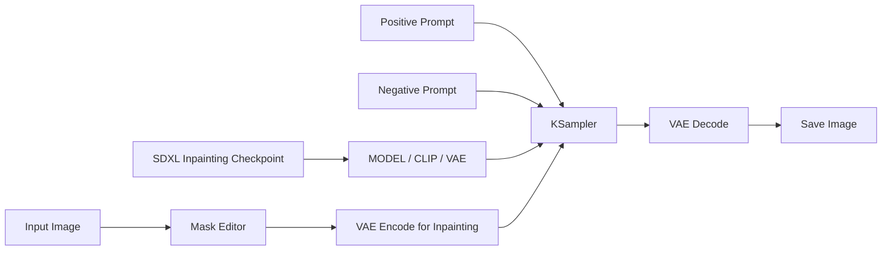
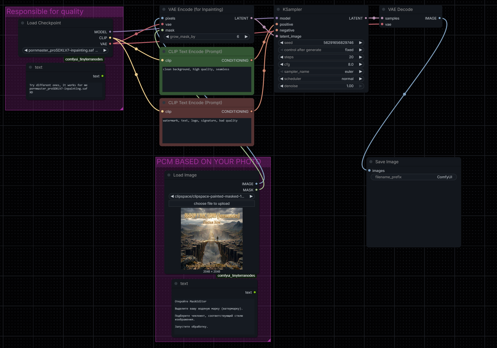
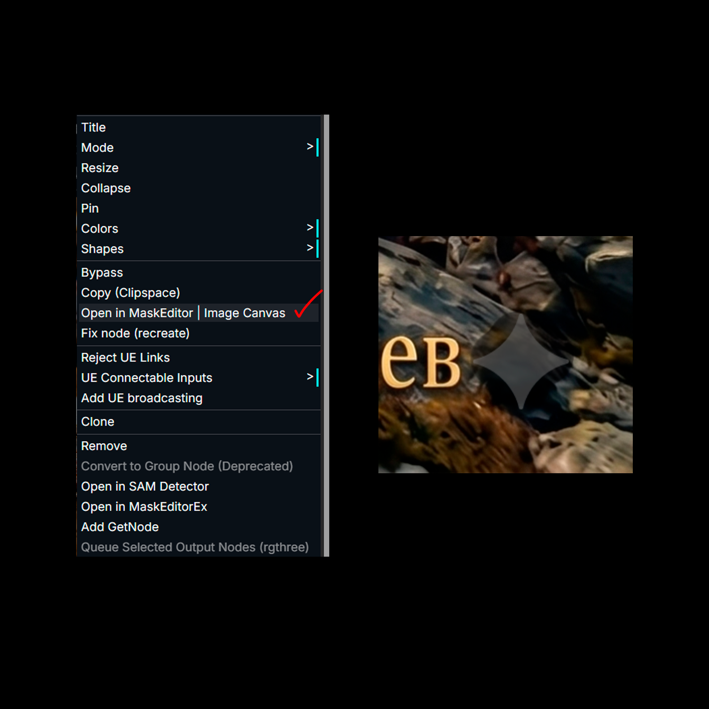
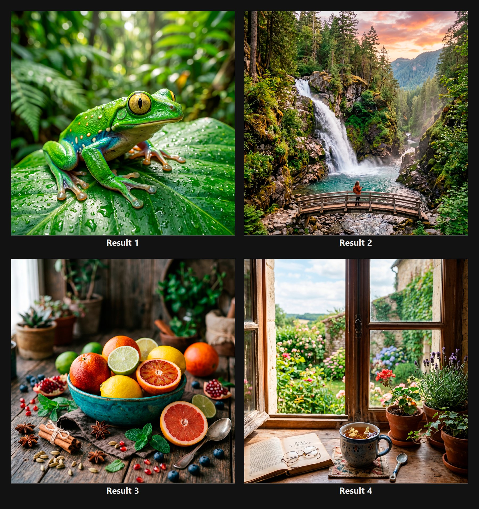

# Image Inpainting Cleanup Pipeline

ComfyUI-based image cleanup and inpainting showcase for object/text removal, background reconstruction and clean before/after restoration results on owned or authorized images.

> Technical showcase: local inpainting workflow, mask-based editing, SDXL inpainting checkpoint setup, prompt strategy, mask expansion, denoise control and before/after result comparison.

## What Is This

This repository documents a local ComfyUI workflow for **inpainting**: repainting selected parts of an existing image while preserving the rest of the frame.

The workflow is useful for:

- cleaning unwanted text overlays;
- removing visual marks from owned/authorized images;
- replacing small logos or signatures in prepared assets;
- reconstructing the background behind removed objects;
- testing SDXL inpainting checkpoints through ComfyUI.

The goal is not just to produce one edited image. The goal is to explain the full pipeline clearly enough that another technical reader can understand how the workflow is structured and why each node exists.

## Project Scope

This showcase focuses on legitimate image cleanup workflows for images that are owned, licensed or authorized for editing. Model weights, private source images and paid assets are not included.

## Pipeline Overview



## Key Workflow Settings

| Area | Value |
|---|---|
| Runtime | ComfyUI |
| Task | Inpainting / selected-region repainting |
| Model type | SDXL inpainting checkpoint |
| Input | Existing image + painted mask |
| Positive prompt | `clean background, high quality, seamless` |
| Negative prompt | `watermark, text, logo, signature, bad quality` |
| Mask expansion | `grow_mask_by = 6` |
| Sampling steps | `20` |
| CFG | `8.0` |
| Sampler | `euler` |
| Scheduler | `normal` |
| Denoise | `1.00` |
| Output | PNG saved by ComfyUI |

Exact settings can change depending on the image, background complexity and checkpoint behavior. The values above describe the working baseline used for the showcase.

## Workflow Preview

| ComfyUI Workflow | Mask Editing |
|---|---|
|  |  |

| Before / After | Result Grid |
|---|---|
|  |  |

## How It Works

1. Load an SDXL inpainting checkpoint.
2. Load the source image.
3. Paint the area that should be reconstructed in ComfyUI MaskEditor.
4. Encode the image and mask through `VAE Encode (for Inpainting)`.
5. Guide the generation with positive and negative prompts.
6. Use KSampler to regenerate only the masked region.
7. Decode and save the cleaned result.

Detailed workflow breakdown: [docs/workflow-breakdown.md](docs/workflow-breakdown.md)

Usage guide: [docs/usage-guide.md](docs/usage-guide.md)

Prompt and mask notes: [docs/prompt-and-mask-notes.md](docs/prompt-and-mask-notes.md)

## Why This Is Useful

Manual cleanup can be slow when the background behind the removed element is complex. Inpainting helps reconstruct the missing region while preserving the rest of the image.

The important technical parts are:

- mask precision;
- checkpoint selection;
- prompt/negative prompt balance;
- mask edge handling;
- denoise strength;
- result comparison.

## Config Example

Public workflow files:

- [configs/comfyui-inpainting-workflow.json](configs/comfyui-inpainting-workflow.json) — sanitized ComfyUI workflow export.
- [configs/comfyui-inpainting-workflow.example.json](configs/comfyui-inpainting-workflow.example.json) — compact workflow descriptor with the key node settings.

The full export is sanitized: private local paths, source images and specific local model filenames are not included.

## Repository Structure

```text
image-inpainting-cleanup-showcase/
|-- README.md
|-- docs/
|   |-- workflow-breakdown.md
|   |-- usage-guide.md
|   |-- prompt-and-mask-notes.md
|   +-- results.md
|-- configs/
|   |-- comfyui-inpainting-workflow.json
|   +-- comfyui-inpainting-workflow.example.json
|-- screenshots/
|   |-- workflow-overview.png
|   |-- mask-editor.png
|   |-- before-after-cleanup.jpg
|   +-- final-results-grid.jpg
|-- results/
|   +-- README.md
|-- LICENSE
+-- .gitignore
```

## Not Included

This repository does not include:

- model weights;
- private source images;
- paid model assets;
- local machine paths;
- API keys or secrets;
- private/original workflow exports.

## License

Documentation and example configuration files are released under the [MIT License](LICENSE).

Model files, private datasets, source images and third-party assets are not included and are not covered by this license.
